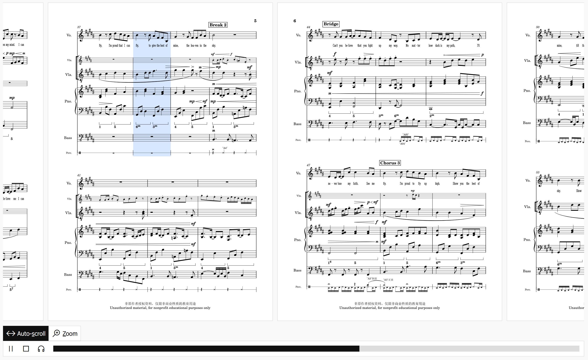

# MuseScore Web Display

> **This is not an officially supported/endoresed [MuseScore](https://musescore.org/) product.**



> You can buy [the original author](https://github.com/yezhiyi9670) [a coffee](https://afdian.net/a/yezhiyi9670) if you like this work.

This is a simple and elegant library allowing you create an interactive showcase of your score, similar to the score showcase seen on musescore.com. [See a working demo here](https://partitioncloud.github.io/musescore-web-display/).

This library uses [Vue](https://vuejs.org/), [Howler](https://github.com/goldfire/howler.js), the [Line Awesome icon font](https://icons8.com/line-awesome) and [webmscore](https://github.com/LibreScore/webmscore). It is deliberately made into a global and buildless library for easy integration with site builders like WordPress.

## Features

- (kind of) mobile friendly.
- Render score pages horizontally, like the way they are in the MuseScore editor.
- Zoom: give a closer look to the score.
- Audio playback, with a cursor highlighting the current measure (auto-scroll included).
- Keyboard shortcuts.
- Add as many tracks as needed, midi, audio and mscz-generated [are supported](#integrating-into-existing-html)

## Running

This is a **buildless** library, hence does not require any build setup. Download the repository, host it via a local HTTP server and access `index.html` in your web browser.

Note that it won't work if you open `index.html` directly in your file explorer.

## Usage

### The Component

The main library is `score-display/score-display.global.js`, which exposes a new HTML component: `<score-display>`.

You have two options to embed a score:
1. export all files using the [python script](./py-script/wd_export.py), and serve these files directly to the client
2. serve directly the MuseScore (mscz) file, the client will convert it on his machine.  
   This will be a bit heavier for the client (~20MB), [exclude very old browsers](https://github.com/LibreScore/webmscore?tab=readme-ov-file#browser-support), [may need a bit of setup to get all fonts working](https://github.com/LibreScore/webmscore?tab=readme-ov-file#load-extra-fonts) but could simplify your backend

#### Serving from exported directory

Your component will look like that:
```html
<score-display src="/your/score/data/path.mscz.wd" type="wd-data">
  <!-- Continue reading this file to see how to add audio & download buttons -->
</score-display>
```


The directory that `src` points to should contain the following files [(example here)](./data/Proud%20Of%20You.mscz.wd/):

```plain
Score Directory
├─ meta.metajson     Score metadata
├─ graphic-1.svg     SVG graphic of score pages, one for each page.
├─ graphic-....svg
├─ graphic-8.svg
└─ measures.mpos     Measure positions, for highlighting the current measure during playback.
```

They can all be exported from MuseScore using the [command line interface](https://musescore.org/en/handbook/3/command-line-options).

See also [the python scripts](./py-script/) that automatically exports all files. The scripts exports the audio for ALL part scores in the form of `audio-%s.ogg` by default.

#### Serving from MuseScore file without exporting

Your component will look like that:
```html
<score-display src="/your/score/data/path.mscz" type="mscz">
  <!-- Continue reading this file to see how to add audio & download buttons -->
</score-display>
```

Unfortunately, [recent MuseScore files are not supported yet by the main branch of webmscore](https://github.com/LibreScore/webmscore/pull/15), you should download artifacts from [here](https://github.com/CarlGao4/webmscore/actions/runs/14575709935) and serve them from your server (look at the first lines of [score-display.global.js](./score-display/score-display.global.js))


### Integrating into existing HTML

Dependencies will be loaded when needed by the script, here is how to integrate it:

1. Add this library.

```html
<link rel="stylesheet" href="./score-display/score-display.css" />
<script type="module" src="./score-display/score-display.global.js"></script>
```

2. A container element for your score showcase (needs to be after the `<script>` tag)

```html
<score-display src="..." type="...">
  <score-track src=".../audio.ogg" type="audio">Piano</score-track><!-- Add audio track -->
  <score-track src=".../audio.mid" type="midi">Piano [mid]</score-track><!-- Add midi track as well! -->

  <!-- Add track from mscz, `src` being optional if the whole score is mscz -->
  <score-track src=".../score.mscz" type="mscz/synth:all">All instruments [from mscz]</score-track>

  <score-download href=".../my score.mscz">Download Mscz</score-download><!-- And download buttons! -->
  <score-download href=".../my score.pdf">Download Pdf</score-download>
</score-display>
```
