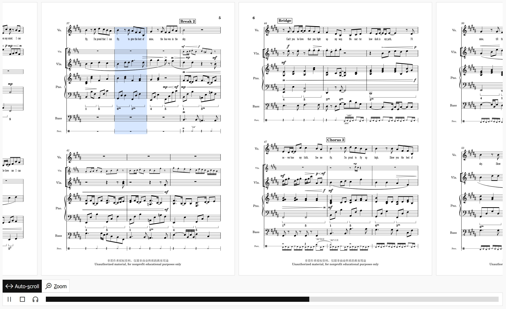

# MuseScore Web Display

> **This is not an officially supported/endorsed [MuseScore](https://musescore.org/) product.**



> Original work from [yezhiyi9670](https://github.com/yezhiyi9670)

This is a simple and elegant library allowing you to create an interactive showcase of your score, similar to the score showcase seen on musescore.com. [See a working demo here](https://partitioncloud.github.io/musescore-web-display/).

This library uses [Vue](https://vuejs.org/), [Howler](https://github.com/goldfire/howler.js), the [Line Awesome icon font](https://icons8.com/line-awesome) and [webmscore](https://github.com/LibreScore/webmscore).

## Features

- (kind of) mobile friendly.
- Render score pages horizontally, like the way they are in the MuseScore editor.
- Zoom: give a closer look to the score.
- Audio playback, with a cursor highlighting the current measure (auto-scroll included).
- Keyboard shortcuts.
- Add as many tracks as needed, midi, audio and mscz-generated [are supported](#integrating-into-existing-html)

## Running

This library is bundled with `rolldown`. You can find bundled code in the [releases tab](https://github.com/partitioncloud/musescore-web-display/releases). You will also need to serve webmscore, that you can download [there](https://github.com/augustin64/MuseScore/releases).  
If you absolutely need a buildless library, the build step was only added in v2.0.0.

## Building

```bash
git clone https://github.com/partitioncloud/musescore-web-display
cd musescore-web-display

make target # This will download webmscore and bundle the main JS file to target/score-display.rolldown.js
```

You can build a bundle without MIDI tracks support, which will be ~10 times smaller with `make target/score-display.rolldown.no-mm.js`.
The `<score-display...>no-cdn.js` versions will require you to serve `line-awesome` and an audio font along with webmscore, the css and js files.

## Usage

### The Component

The main library is `score-display/score-display.global.js`, which exposes a new HTML component: `<score-display>`.

You have two options to embed a score:
1. export all files using the [python script](./py-script/wd_export.py), and serve these files directly to the client
2. serve directly the MuseScore (mscz) file, that will be processed in the client's browser.  
   This will be a bit heavier for the client (~20MB), [exclude very old browsers](https://github.com/LibreScore/webmscore?tab=readme-ov-file#browser-support), [may need a bit of setup to get all fonts working](https://github.com/LibreScore/webmscore?tab=readme-ov-file#load-extra-fonts) on some scores, but will simplify your backend

#### Serving from exported directory

Your component will look like that:
```html
<score-display src="/your/score/data/path.mscz.wd" type="wd-data">
  <!-- Continue reading this file to see how to add audio & download buttons -->
</score-display>
```


The directory that `src` points to should contain the following files [(example here)](./data/Proud%20Of%20You.mscz.wd/):

```plain
Score Directory
├─ meta.metajson     Score metadata
├─ graphic-1.svg     SVG graphic of score pages, one for each page.
├─ graphic-....svg
├─ graphic-8.svg
└─ measures.mpos     Measure positions, for highlighting the current measure during playback.
```

They can all be exported from MuseScore using the [command line interface](https://musescore.org/en/handbook/3/command-line-options).

See also [the python scripts](./py-script/) that automatically exports all files. The scripts exports the audio for ALL part scores in the form of `audio-%s.ogg` by default.

#### Serving from MuseScore file without exporting

Your component will look like that:
```html
<score-display src="/your/score/data/path.mscz" type="mscz">
  <!-- Continue reading this file to see how to add audio & download buttons -->
</score-display>
```

Unfortunately, this requires an up-to-date version of webmscore, and recent versions of MuseScore aren't always supported (currently, supports v4.6.5).


### Integrating into existing HTML

Dependencies will be loaded when needed by the script, here is how to integrate it:

1. Add this library.

```html
<link rel="stylesheet" href="<path to library>/score-display.css" />
<script type="module" src="<path to library>/score-display.rolldown.js"></script>
```

In `<path to library>`, you will need to serve:
```
├── score-display.css
├── score-display.rolldown.js   or any of its variants
├── soundfonts                 *if using a no-cdn.js variant
│   └── FluidR3Mono_GM.sf3
├── style                      *if using a no-cdn.js variant
│   └── line-awesome
└── webmscore                   if you plan to load scores with type!=wd-data
```
Those are obtainable through `make webmscore target/style/line-awesome target/soundfonts/FluidR3Mono_GM.sf3`

2. A container element for your score showcase (needs to be after the `<script>` tag)

```html
<score-display src="..." type="...">
  <score-track src=".../audio.ogg" type="audio">Piano</score-track><!-- Add audio track -->
  <score-track src=".../audio.mid" type="midi">Piano [mid]</score-track><!-- Add midi track as well! -->

  <!-- Add track from mscz, `src` being optional if the whole score is mscz -->
  <score-track src=".../score.mscz" type="mscz/synth:all">All instruments [from mscz]</score-track>

  <score-download href=".../my score.mscz">Download Mscz</score-download><!-- And download buttons! -->
  <score-download href=".../my score.pdf">Download Pdf</score-download>
</score-display>
```
